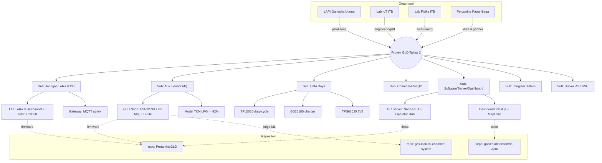
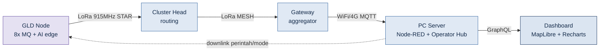
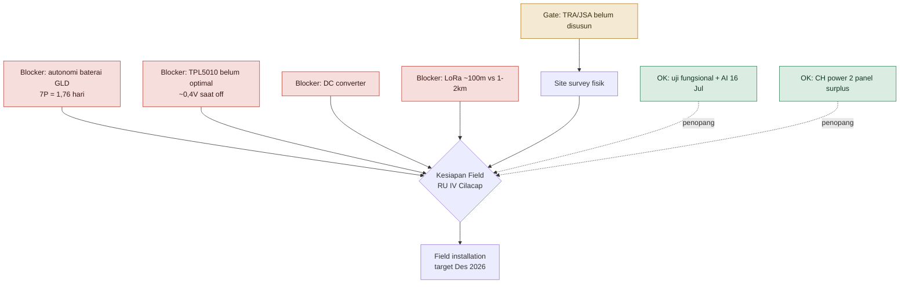
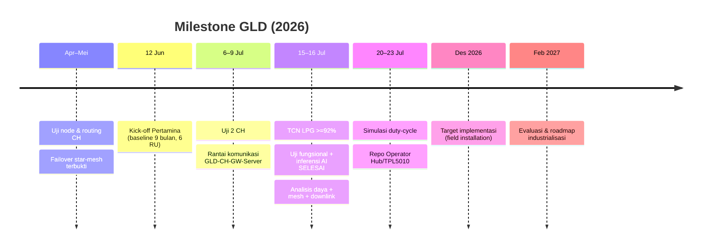

# Knowledge Graph — GLD V2

Graph relasi entitas proyek (Mermaid — render otomatis di GitHub & artifact). Versi machine-readable: [`graph.json`](graph.json).

## 1. Peta entitas (org → sub-sistem → perangkat/repo)

## 2. Alur data end-to-end + pemetaan repo

Repo: 🟪 ML edge (gas-leak-ml-chamber-system) · 🟦 firmware+server (PertaminaGLD) · 🟦navy dashboard (gasleakdetectionV2-April).

## 3. Dependensi blocker → kesiapan lapangan

## 4. Timeline milestone

